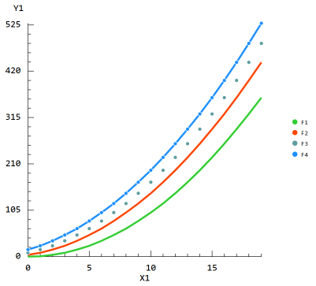
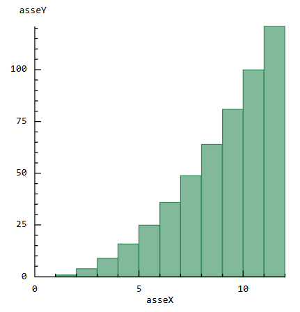
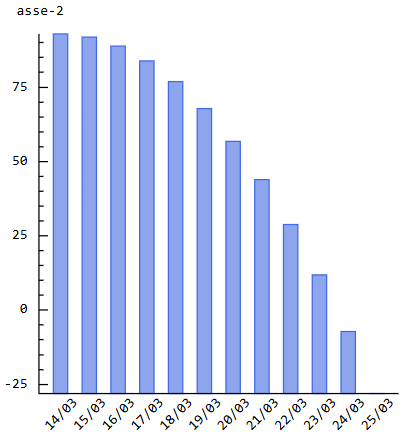
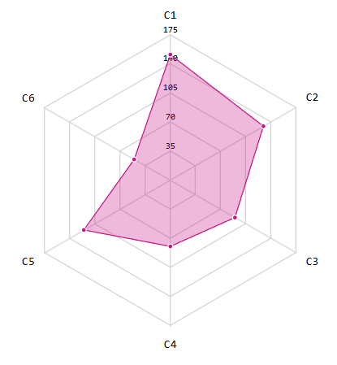
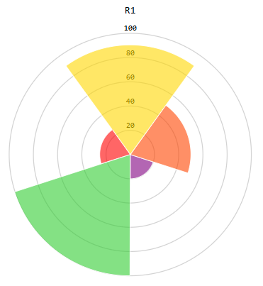
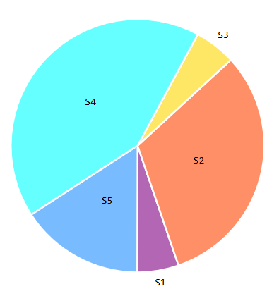
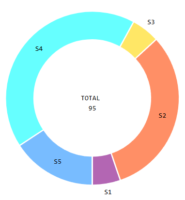

BlazorGraphs is a **lightweight SVG chart library for Blazor** with **no Javascript dependency**.
Build fast, interactive charts using pure Blazor rendering.

#### Why BlazorGraphs?
- Pure Blazor rendering (no JS interop)
- Lightweight SVG output
- Zero external dependencies
- Simple API, fast integration

#### Charts

